# Dilivideo-Flutter （更新中）

个人flutter练手项目。

⭕原型：bilibili国际版IOS客户端


## 环境

Flutter 3.7.0-10.0.pre.15 • channel master • https://github.com/flutter/flutter.git
Framework • revision 76bb8ead5a (5 months ago) • 2022-12-15 19:38:53 -0800
Engine • revision 29196519c1
Tools • Dart 3.0.0 (build 3.0.0-21.0.dev) • DevTools 2.20.0

<br/>

## 插件

<br/>

```yaml
  dio: ^5.0.1
  get:
  flutter_svg: ^2.0.2
  shared_preferences: ^2.0.18
  image_picker: ^0.8.6+4
  video_player: ^2.5.3
  font_awesome_flutter: ^10.4.0
  cached_network_image: ^3.2.3
```

<br/>

## 说明

项目 API 见另一个仓库: DiliVideo-SpringCloud

<br/>

<br/>

## 运行截图


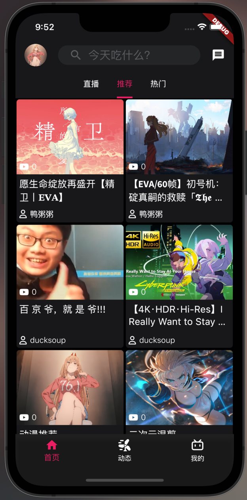


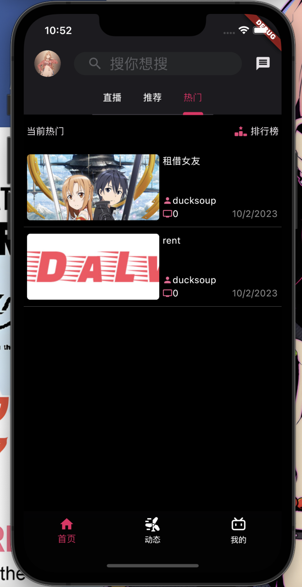


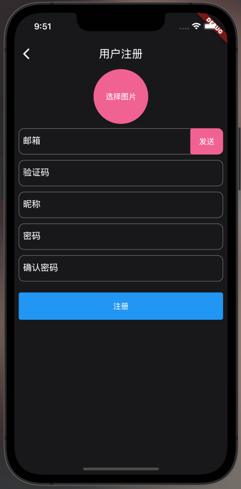


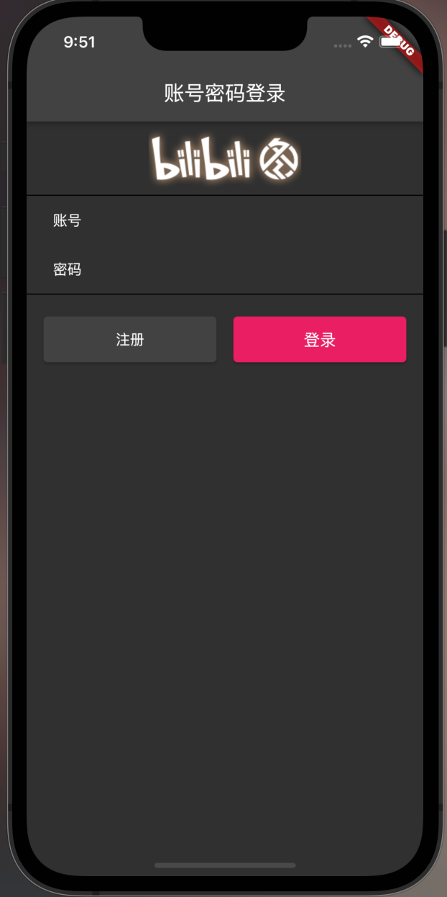


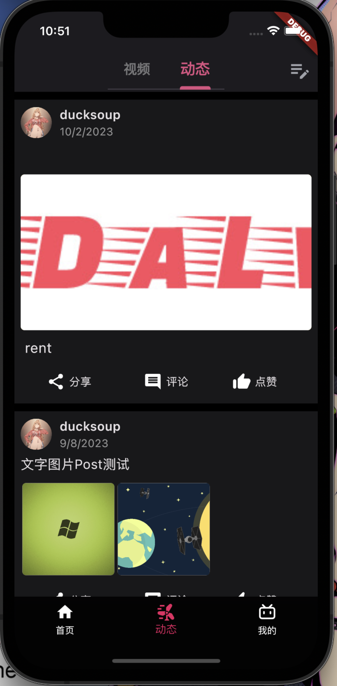


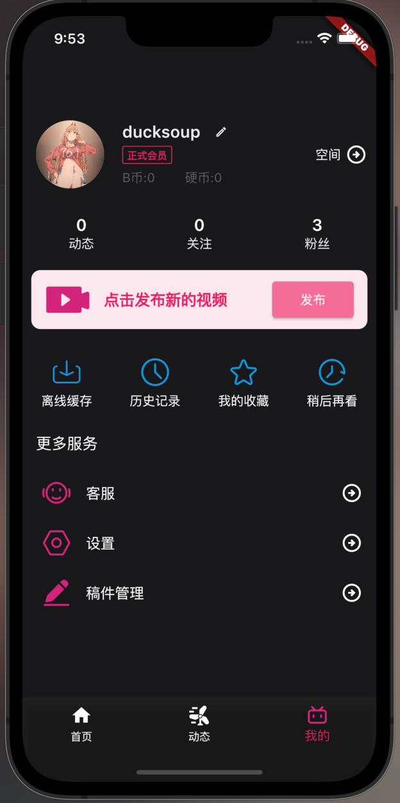


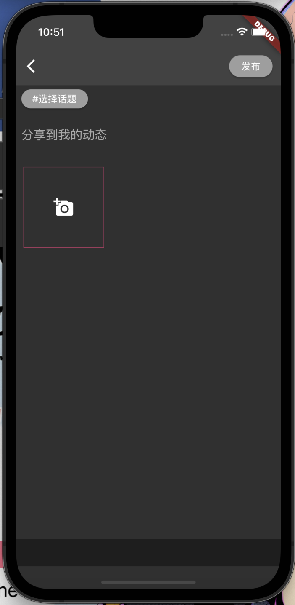


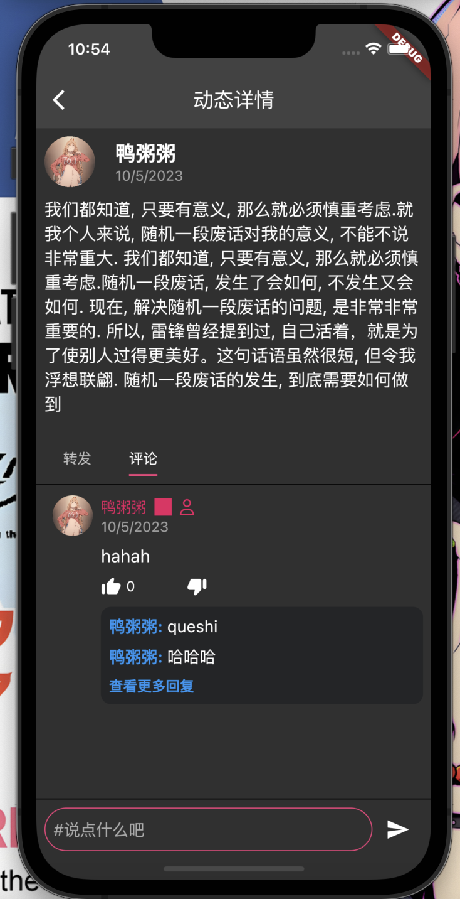


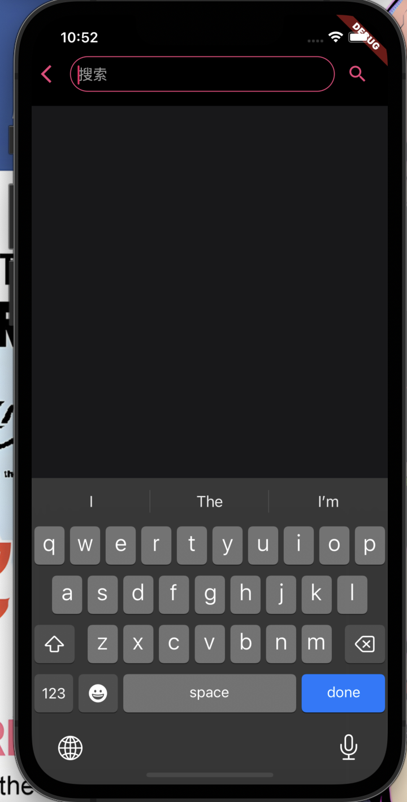


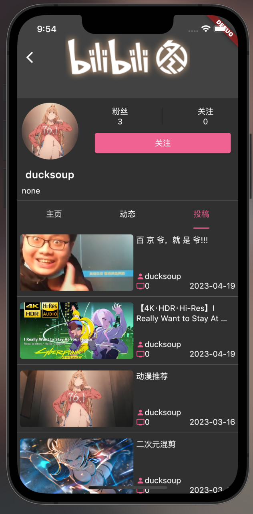


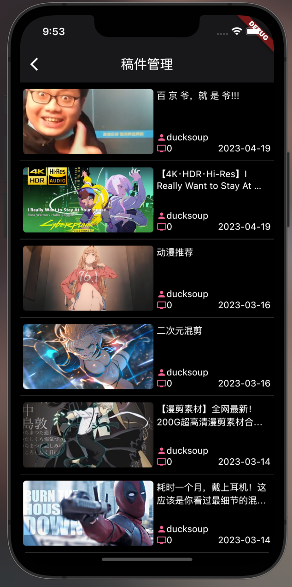


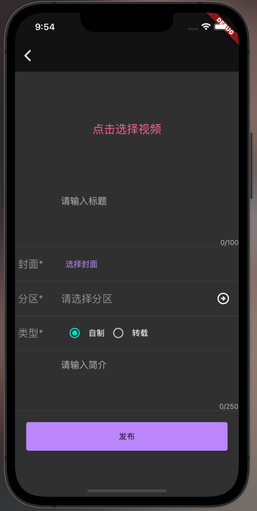


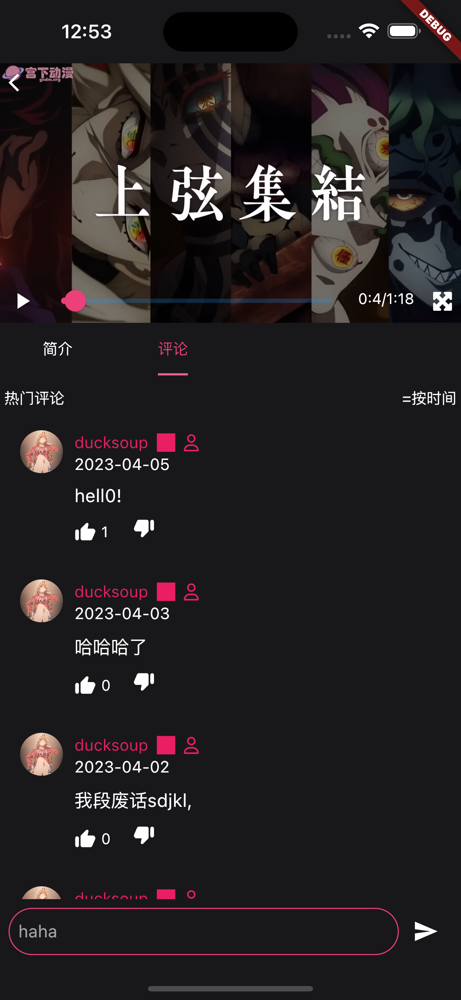


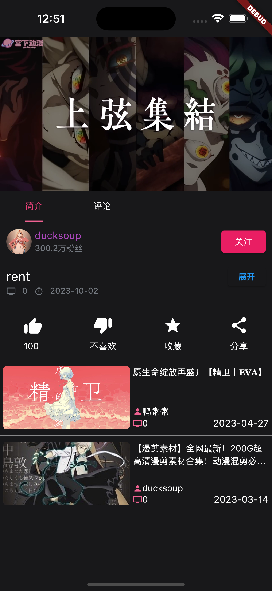
